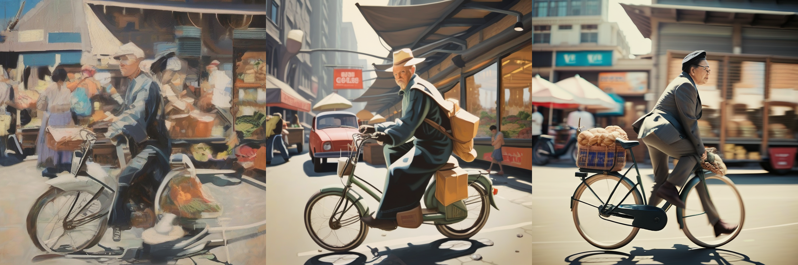
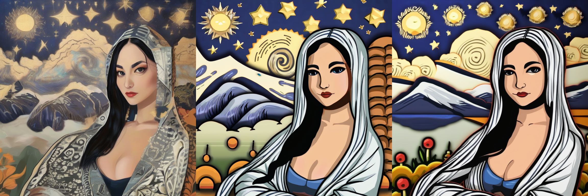
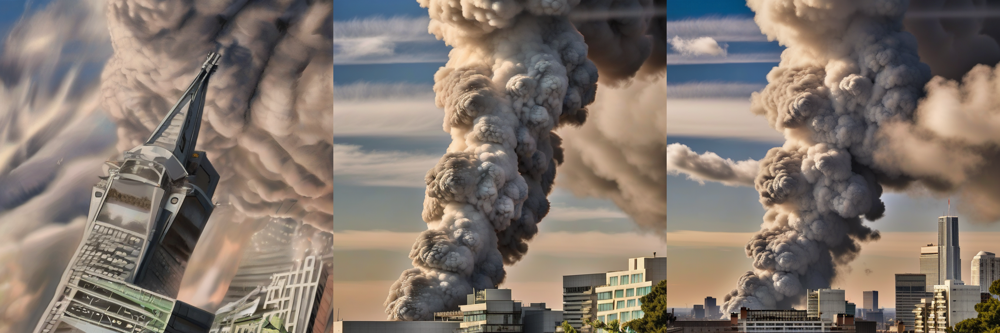
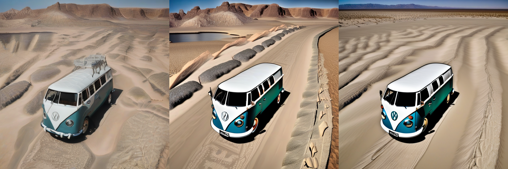

# 5 New Methods to Perform Guided Sampling from Diffusion Models using Attention Maps

This work is inspired by SEG (https://arxiv.org/abs/2408.00760)

## 5 Methods to "Perturb" the Attention Maps in the Guidance Network 

**Method1: Perturb the Query weights 

**Method2: QK-Dropout 

**Method3: Bilateral Filter

**Method4: Erosion

**Method5: Dilation

In the following images, the top row corresponds to vanilla SDXL, SEG(sigma=10) and SEG(sigma=infinity)

The bottom row is with the 5 new methods 

``A raccoon playing guitar next to a blue ocean"
<p align="center">
  
  
</p>

``A man riding a bicycle near a busy vegetable market"
<p align="center">
  
  
</p>

``A painting of Mona Lisa in the style of starry nights"
<p align="center">
  
  
</p>

``A volcano erupting in New York City"
<p align="center">
  
  
</p>

A blue VW van driving in the desert
<p align="center">
  
  
</p>


## 🛠️ Installation

Please refer to the SEG git repo (https://github.com/SusungHong/SEG-SDXL/tree/master) and follow the instructions 


## 🚀 Quickstart

This is an example of a Python script:
```python
from pipeline_seg import StableDiffusionXLSEGPipeline
import torch
from diffusers.utils import make_image_grid
import PIL
from PIL import Image

pipe = StableDiffusionXLSEGPipeline.from_pretrained(
    "stabilityai/stable-diffusion-xl-base-1.0",
    torch_dtype=torch.float16
)
device="cuda"
pipe = pipe.to(device)

prompts = [
"A raccoon playing guitar next to a blue ocean",
]
seed = 5

output = []
for prompt in prompts:

    # ATTN GUIDANCE option = 1  (Wq + W_rnd)     
    generator = torch.Generator(device="cuda").manual_seed(seed)
    output += pipe(
            [prompt],
            num_inference_steps=25,
            height=768,
            width=768,
            guidance_scale=1.0,
            seg_scale=3.0,
            seg_blur_sigma=10000000000.0,
            attn_guid_option=1,
            seg_applied_layers=['mid'],
            generator=generator,
        ).images
    
    # ATTN GUIDANCE option = 2 (QK dropout)     
    generator = torch.Generator(device="cuda").manual_seed(seed)
    output += pipe(
            [prompt],
            num_inference_steps=25,
            height=768,
            width=768,
            guidance_scale=1.0,
            seg_scale=3.0,
            seg_blur_sigma=10000000000.0,
            attn_guid_option=2,
            seg_applied_layers=['mid'],
            generator=generator,
        ).images
    
    # ATTN GUIDANCE option = 3 (Bilateral filter)     
    generator = torch.Generator(device="cuda").manual_seed(seed)
    output += pipe(
            [prompt],
            num_inference_steps=25,
            height=768,
            width=768,
            guidance_scale=1.0,
            seg_scale=3.0,
            seg_blur_sigma=10000000000.0,
            attn_guid_option=3,
            seg_applied_layers=['mid'],
            generator=generator,
        ).images
    
    # ATTN GUIDANCE option = 4 (Erosion)     
    generator = torch.Generator(device="cuda").manual_seed(seed)
    output += pipe(
            [prompt],
            num_inference_steps=25,
            height=768,
            width=768,
            guidance_scale=1.0,
            seg_scale=3.0,
            seg_blur_sigma=10000000000.0,
            attn_guid_option=4,
            seg_applied_layers=['mid'],
            generator=generator,
        ).images
    
    # ATTN GUIDANCE option = 5 (Dilation)     
    generator = torch.Generator(device="cuda").manual_seed(seed)
    output += pipe(
            [prompt],
            num_inference_steps=25,
            height=768,
            width=768,
            guidance_scale=1.0,
            seg_scale=3.0,
            seg_blur_sigma=10000000000.0,
            attn_guid_option=5,
            seg_applied_layers=['mid'],
            generator=generator,
        ).images
    
grid = make_image_grid(output, rows=1, cols=5)
grid.save("raccoon_bottom.png")
```

Note that when attn_guid_option = 3 or 4 or 5, the value of guidance_scale and seg_blur_sigma are ignored


